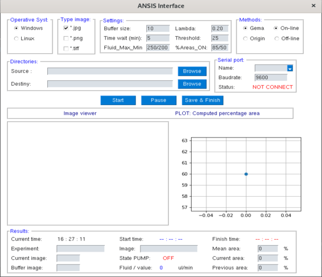
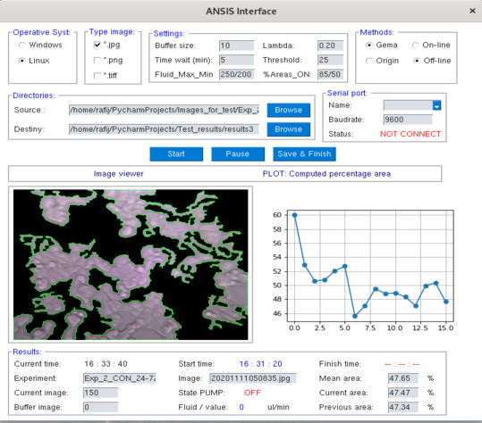
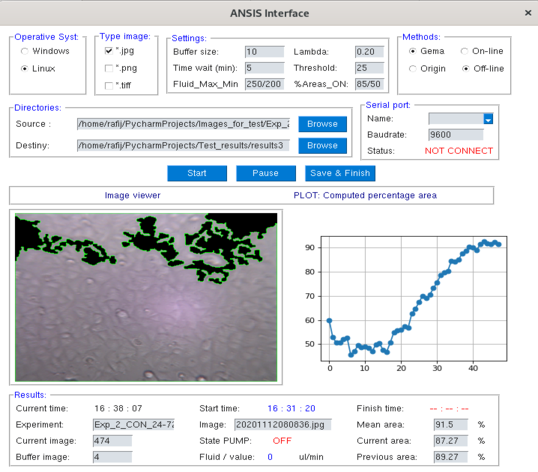

# ANSIS Control Interface
ANSIS by **Analysis of cells Images using Segmentation methods for automatic control** is a GUI Interface programmed in *PYTHON* using PySimpleGUI for image segmentation and control growing process. 
This is a test version 0.1.2

In directory */src*, you will find an user guide document.

## Run of ANSIS
Ansis could be use in 2 modes: ONLINE (during the biology process) or OFFLINE (analysis of image from a directory). The core of this software is GEMA. GEMA is an algorithm developed and used for image segmentation using a linear regression of cofficient of variation accordding the histogram. 

### Example of ANSIS evolution

------------ | -------------
 | 

ANSIS will be presented in a **scientific paper** in the next months.
